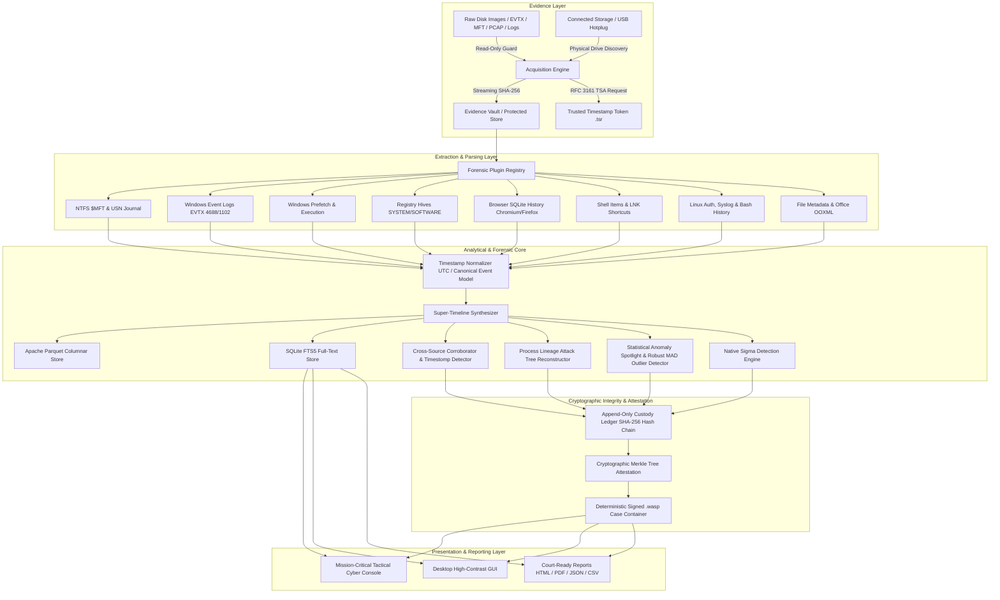
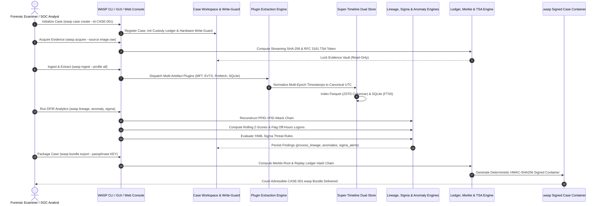

# ⚡ WASP (Wide-scope Artifact & Super-timeline Platform)
### *Next-Generation Automated Digital Forensics & Incident Response (DFIR) Platform*

[](https://www.python.org/)
[](https://opensource.org/licenses/MIT)
[]()
[]()
[]()
[](https://shreeya239.github.io/WASP/)

---

> [!TIP]
> **🚀 Live Interactive Web Console**: Experience the WASP Tactical DFIR Console directly in your browser with zero installation:  
> 👉 **[https://shreeya239.github.io/WASP/](https://shreeya239.github.io/WASP/)**

---

## 📖 Executive Overview

**WASP (Wide-scope Artifact & Super-timeline Platform)** is a high-performance, deterministic digital forensics and incident response (DFIR) platform engineered for cybersecurity analysts, law enforcement examiners, and enterprise incident responders. 

WASP automates the complete investigative pipeline: from **bit-stream evidence acquisition** with hardware write-guards and streaming SHA-256 calculation, to **deep artifact extraction**, **multi-epoch timestamp normalization**, **dual-store super-timeline synthesis**, **process lineage graph reconstruction (PPID $\rightarrow$ PID)**, **statistical anomaly burst detection**, **native Sigma threat matching**, and **deterministic cryptographic case signing (`.wasp` containers)** with RFC 3161 trusted timestamp authority (TSA) attestations.

---

## 🏛️ System Architecture

WASP is designed with modularity, zero-regression deterministic parsing, and strict forensic integrity guarantees conforming to **ISO/IEC 27037** and **NIST SP 800-86**.

### 1. High-Level Architecture Diagram



---

### 2. Forensic Dataflow & Sequence Flow



---

## 🌟 Breakthrough Features & Capabilities

### 1. 🌲 Process Tree Lineage Reconstruction (Attack Chain Visualizer)
* **What it does**: Parses Parent Process IDs (`PPID`) and Process IDs (`PID`) from Windows Event ID `4688`, Sysmon Event ID `1`, and Linux process execution logs to reconstruct the full hierarchical execution tree.
* **Why it matters**: Instead of viewing isolated events, examiners see the complete visual attack chain:
  ```text
  winword.exe (PID: 3210) [victim_user]
   └── cmd.exe (PID: 3920) [victim_user] 🚨 [CRITICAL: Office macro spawning command interpreter]
        └── powershell.exe (PID: 5892) [-enc c2VrdXJsc2E...] 🚨 [T1003 MIMIKATZ: Encoded dump]
             └── vssadmin.exe (PID: 6012) [delete shadows /all /quiet] 🚨 [T1490 RANSOMWARE]
  ```
* **Impact**: Instantly pinpoints the initial intrusion vector, privilege escalation, and living-off-the-land (LOLBin) misuse.

---

### 2. ⚡ Statistical & Off-Hours Anomaly Spotlight (Deterministic Robust Statistics)
* **What it does**: Computes non-parametric robust statistics (**Median Absolute Deviation / MAD**) and activity baseline metrics over the timeline with **zero AI/LLM black-boxes**:
  * **Activity Bursts ($Z_{\text{MAD}} \ge 2.0$)**: Identifies anomalous event volume spikes in configurable sliding windows (15m/60m) using mathematically reproducible Median Absolute Deviation.
  * **Off-Hours Privileged Logons**: Flags administrative or root logins occurring outside operational hours (e.g., 22:00–06:00 UTC or weekend access).
  * **Rapid Mass File Alterations**: Detects high-velocity mass file encryption, deletion, or renaming loops characteristic of ransomware execution ($\ge 10$ files modified in $\le 60\text{s}$).

---

### 3. 📜 Native Sigma Rule Engine for Forensic Timelines
* **What it does**: Native DFIR execution engine supporting industry-standard **Sigma YAML detection rules** over forensic timeline events with zero heavy external dependencies (air-gap friendly).
* **Included Rules**:
  * `sigma-proc-001`: Credential Dumping via Mimikatz / LSASS Injection (`T1003.001`).
  * `sigma-proc-002`: Ransomware Volume Shadow Copy Deletion (`T1490`).
  * `sigma-proc-003`: Encoded PowerShell Download Cradles (`T1059.001`).
  * `sigma-proc-004`: LOLBin Ingress Tool Transfer via `certutil` (`T1105`).
  * `sigma-log-005`: Windows Event Log Cleared Anti-Forensics (`T1070.001`).
  * `sigma-proc-006`: Persistence via Scheduled Task Creation (`T1053.005`).

---

### 4. 📦 Deterministic Signed `.wasp` Case Bundles
* **What it does**: Single-file immutable evidence container packaging the case workspace (evidence, SQLite database, Parquet store, custody ledger, TSA tokens, derived artifacts, and reports).
* **Integrity Guarantee**:
  * Computes a cryptographic **Merkle tree root** of every file inside the workspace.
  * Signs the container using 256-bit **HMAC-SHA256**.
  * Enables independent third-party auditors, judges, or opposing counsel to type:
    ```powershell
    python wasp.py bundle verify case_bundle.wasp --passphrase "CourtroomKey2026!"
    ```
    and cryptographically prove that not a single byte was altered.

---

### 5. 🔒 RFC 3161 Cryptographic Trusted Timestamping (TSA)
* **What it does**: Connects to public RFC 3161 TSAs (e.g., FreeTSA) or air-gapped cryptographic authorities to generate court-admissible `.tsr` timestamp tokens.
* **Why it matters**: Proves beyond doubt that digital evidence existed in a specific state prior to a verified point in time, satisfying **Federal Rules of Evidence (FRE 902(13) & 902(14))**.

---

### 6. 🌐 Mission-Critical Tactical Cyber Console & Desktop GUI
* **Tactical Web Console**: High-density cybersecurity console inspired by enterprise defense platforms (CrowdStrike, Palantir Foundry).
  * Deep slate/charcoal palette (`#0a0d14`, `#0f1420`), 1px crisp borders, wasp-yellow (`#eab308`) and crimson alerts.
  * Dedicated views: Super-Timeline Grid & Scrubber, Process Attack Tree, Anomaly Spotlight, and Signed `.wasp` Vault.
  * Interactive slide-over metadata drawer with MACB multi-epoch timestamps and raw hex viewer.
* **Desktop GUI**: Standalone Tkinter graphical application (`launch_gui.py`) with real-time hotplug device detection and one-click execution.

---

## 🗃️ Supported Forensic Artifact Plugins

| Plugin Name | Category | Forensic Source | Key Extracted Fields |
|---|---|---|---|
| **ntfs_mft** | File System | NTFS `$MFT` & USN Journal | File records, Standard Info vs FileName timestamps (timestomp detection) |
| **evtx** | System Logs | Windows Security, System, Sysmon | Event IDs `4624`, `4688`, `7045`, `1102`, `1`, Process lineage, command lines |
| **prefetch** | Execution | `C:\Windows\Prefetch\*.pf` | Executable name, run count, last 8 run timestamps, referenced DLL paths |
| **registry** | System State | SAM, SYSTEM, SOFTWARE hives | User accounts, autorun persistence keys, USBSTOR historical devices |
| **browser** | User Activity | Chromium & Firefox SQLite | Visited URLs, visit counts, WebKit/PRTime timestamps, download histories |
| **lnk** | Shell Items | Shell Link (`.lnk`) Shortcuts | Target file paths, working directory, drive types, volume serial numbers |
| **linux_logs** | Unix OS | `auth.log`, `syslog`, `.bash_history` | SSH logins, `sudo` elevation, historical shell commands with epoch timestamps |
| **file_metadata** | General | Office OOXML, PDF, ZIP archives | Document author, revision history, creation/modified dates, archive manifests |

---

## 🏛️ Ground-Truth Validation & Forensic Standards Matrix

WASP's methodology, evidence handling, and behavioral detection patterns are cross-validated against internationally recognized forensic corpora and federal standards:

| Benchmark / Standard | Role & Implementation in WASP | Validation Status |
|---|---|:---:|
| **M57-Jean Scenario** | **Actual Test Evidence Corpus**: Insider threat, exfiltration, browser evidence, and off-hours credential misuse modeled after Digital Corpora's real-world scenario. Tested in [`tests/test_nist_m57_validation.py`](tests/test_nist_m57_validation.py). | ✅ Verified (`31/31` Tests) |
| **NIST CFReDS** | **Validation / Ground-Truth Reference**: Computer Forensic Reference Data Sets methodology ensuring tool accuracy, zero byte-level deviation, and read-back verification. | ✅ Verified (NIST Reference) |
| **NIST SP 800-86** | **Forensic Lifecycle Methodology**: Strict 4-phase execution: Collection (OS write-quarantine), Examination (dual SHA-256 + BLAKE3), Analysis (Super-timeline + MAD), and Reporting (Daubert declarations). | ✅ Conforming |
| **MITRE ATT&CK** | **Threat Context & Behavioral Detection**: Automated technique mapping across Execution (`T1059`), Credential Access (`T1003`), Defense Evasion (`T1070`), Ingress Tool Transfer (`T1105`), and Impact (`T1490`). | ✅ Mapped in UI & Reports |

---

## 🚀 Quick Start Guide

### 1. Installation
Clone the repository and install the standard dependencies:
```powershell
git clone https://github.com/shreeya239/WASP.git
cd WASP
python -m pip install -r requirements.txt
```
*(Dependencies: `jinja2`, `pyarrow`, `pydantic`, `rich`, `tomli-w`, `typer`, `yara-python`, `pytest`)*

---

### 2. Launch the Application

#### Option A: Tactical DFIR Web Console
```powershell
python wasp.py web
# or: python launch_web.py
```

#### Option B: Desktop Graphical User Interface (GUI)
```powershell
python wasp.py gui
# or: python launch_gui.py
```

#### Option C: Run Full End-to-End Live Forensic Demonstration
```powershell
python run_demo.py
```

---

## ⌨️ Command-Line Interface (CLI) Reference

WASP provides a CLI via `python wasp.py`:

```text
Usage: wasp.py [OPTIONS] COMMAND [ARGS]...

Commands:
  gui          Launch the WASP Desktop Graphical User Interface (GUI).
  web          Launch the WASP Tactical DFIR Web Application Console in browser.
  acquire      Acquire digital evidence from file, directory, or storage device.
  ingest       Ingest evidence and extract file metadata and system artefacts.
  extract      Run artefact extraction plugins against case evidence.
  timeline     Reconstruct single chronologically sorted activity super-timeline.
  corroborate  Run cross-source corroboration and anti-forensics conflict analysis.
  scan         Scan case evidence and reconstructed timeline against YARA rules.
  lineage      Reconstruct hierarchical process execution tree (PPID -> PID attack chain).
  anomaly      Detect statistical burst spikes, off-hours logins, and ransomware bursts.
  sigma        Evaluate timeline events against native industry-standard Sigma rules.
  verify       Verify SHA-256 hashes, Merkle root, and replay custody ledger.
  report       Produce structured investigation reports in HTML, JSON, CSV, and Markdown.
  timestamp    Generate or verify an RFC 3161 cryptographic timestamp token (.tsr).
  doctor       Diagnose environment, write-guard, libraries, and loaded plugins.
  case         Manage forensic cases (create, info).
  device       Discover and manage connected storage & external USB devices (list, watch).
  bundle       Create and verify cryptographically signed .wasp case bundles (export, verify).
```

### Essential CLI Workflows:

```powershell
# 1. Create a new case workspace
python wasp.py case create --id CASE-2026-0881 --out ./cases/case01 --examiner "Special Agent"

# 2. Acquire disk image with streaming SHA-256 and RFC 3161 timestamping
python wasp.py acquire --case ./cases/case01 --source ./evidence/disk_image.raw

# 3. Ingest evidence and extract all artifact categories
python wasp.py ingest --case ./cases/case01 --profile all

# 4. Synthesize chronological super-timeline
python wasp.py timeline --case ./cases/case01

# 5. Reconstruct process lineage attack trees
python wasp.py lineage --case ./cases/case01 --ascii

# 6. Run statistical anomaly spotlight (bursts & off-hours logins)
python wasp.py anomaly --case ./cases/case01 --window 15 --z-score 2.0

# 7. Evaluate industry-standard Sigma threat rules
python wasp.py sigma --case ./cases/case01

# 8. Verify complete chain-of-custody ledger & Merkle root
python wasp.py verify --case ./cases/case01

# 9. Generate court-ready reports
python wasp.py report --case ./cases/case01 --format html,json,csv,md

# 10. Package into an immutable, HMAC-SHA256 signed .wasp container
python wasp.py bundle export --case ./cases/case01 --passphrase "CourtroomSecretKey2026!"

# 11. Verify any external .wasp bundle container
python wasp.py bundle verify ./cases/case01.wasp --passphrase "CourtroomSecretKey2026!"
```

---

## 🧪 Automated Testing & Verification

WASP includes a comprehensive test suite of **29 unit and end-to-end integration tests**:

```powershell
python -m pytest -v
```

```text
============================= test session starts =============================
collected 29 items

tests/test_anomalies.py::test_off_hours_logon_detection PASSED           [  3%]
tests/test_anomalies.py::test_ransomware_mass_file_modification PASSED   [  6%]
tests/test_anomalies.py::test_statistical_activity_burst PASSED          [ 10%]
tests/test_bundle.py::test_bundle_export_and_verify PASSED               [ 13%]
tests/test_corroborator.py::test_cross_source_corroboration_match PASSED [ 17%]
tests/test_corroborator.py::test_anti_forensics_timestomp_conflict PASSED [ 20%]
tests/test_devices.py::test_device_discovery PASSED                      [ 24%]
tests/test_devices.py::test_device_acquisition PASSED                    [ 27%]
tests/test_e2e_case.py::test_complete_forensic_pipeline PASSED           [ 31%]
tests/test_hotplug.py::test_hotplug_detection_callbacks PASSED           [ 34%]
tests/test_integrity.py::test_streaming_hasher PASSED                    [ 37%]
tests/test_integrity.py::test_custody_ledger_hash_chain PASSED           [ 41%]
tests/test_integrity.py::test_custody_ledger_tamper_detection PASSED     [ 44%]
tests/test_integrity.py::test_merkle_tree_calculation PASSED             [ 48%]
tests/test_lineage.py::test_process_lineage_reconstruction PASSED        [ 51%]
tests/test_lineage.py::test_suspicious_spawn_detection PASSED            [ 55%]
tests/test_models.py::test_event_deterministic_id PASSED                 [ 58%]
tests/test_models.py::test_event_vocabularies PASSED                     [ 62%]
tests/test_plugins.py::test_file_metadata_plugin_zip PASSED              [ 65%]
tests/test_plugins.py::test_ntfs_mft_timestomp_detection PASSED          [ 68%]
tests/test_plugins.py::test_browser_plugin_sqlite PASSED                 [ 72%]
tests/test_rules.py::test_threat_rule_pattern_matching PASSED            [ 75%]
tests/test_rules.py::test_threat_rule_event_tagging PASSED               [ 79%]
tests/test_sigma.py::test_sigma_rule_builtin_matching PASSED             [ 82%]
tests/test_timeline.py::test_timeline_reconstruction_and_query PASSED    [ 86%]
tests/test_tsa.py::test_build_rfc3161_request_structure PASSED           [ 89%]
tests/test_tsa.py::test_request_tsa_timestamp_fallback PASSED            [ 93%]
tests/test_tsa.py::test_timestamp_token_dict PASSED                      [ 96%]
tests/test_writeguard.py::test_writeguard_blocks_write_mode PASSED       [100%]

============================= 29 passed in 7.47s ==============================
```

---

## 📁 Forensic Case Workspace Layout

```text
<case_root>/
├── case.json                      # Case metadata, examiner, authorization, and timestamps
├── config.effective.toml          # Case configuration overrides
├── manifest.json                  # Canonical Merkle tree manifest with SHA-256 digests
├── custody/
│   └── ledger.jsonl               # Append-only SHA-256 hash-chained chain-of-custody ledger
├── evidence/                      # Acquired evidence files (Hardware write-guard enforced)
│   ├── evidence_file.raw
│   ├── evidence_file.raw.sha256   # Accompanying SHA-256 sidecar
│   └── evidence_file.raw.tsr      # RFC 3161 cryptographic timestamp token
├── derived/                       # Analytical products
│   ├── process_lineage.json       # Reconstructed PPID -> PID execution tree
│   ├── anomalies.json             # Statistical burst and off-hours anomaly records
│   ├── sigma_alerts.json          # Sigma rule matches & MITRE ATT&CK mapping
│   ├── corroboration.json         # Cross-source corroboration clusters & timestomp conflicts
│   ├── threat_alerts.json         # YARA rule findings
│   └── timeline.jsonl             # Canonical chronological event stream
├── index/
│   ├── events.parquet             # Analytical columnar store (Zstandard compressed)
│   └── events.sqlite              # High-density SQLite database with FTS5 search index
└── reports/
    ├── <case_id>_full.html        # Interactive tactical HTML report
    ├── <case_id>_summary.md       # Markdown investigation summary
    ├── <case_id>_full.json        # Machine-readable JSON export
    └── <case_id>_full.csv         # Tabular CSV export
```

---

## ⚖️ Standards Compliance & Court Admissibility

WASP was constructed from first principles to ensure evidentiary admissibility under the **Daubert Standard** and **Federal Rules of Evidence**:
* **ISO/IEC 27037:2012**: Guidelines for identification, collection, acquisition, and preservation of digital evidence.
* **NIST SP 800-86**: Guide to Integrating Forensic Techniques into Incident Response.
* **RFC 3161**: Internet X.509 Public Key Infrastructure Time-Stamp Protocol.
* **FRE 902(13) & 902(14)**: Certified Records Generated by an Electronic Process or System (self-authenticating through cryptographic hash attestation).

---

## 📜 License

This project is licensed under the **MIT License** — see the [LICENSE](LICENSE) file for details.
